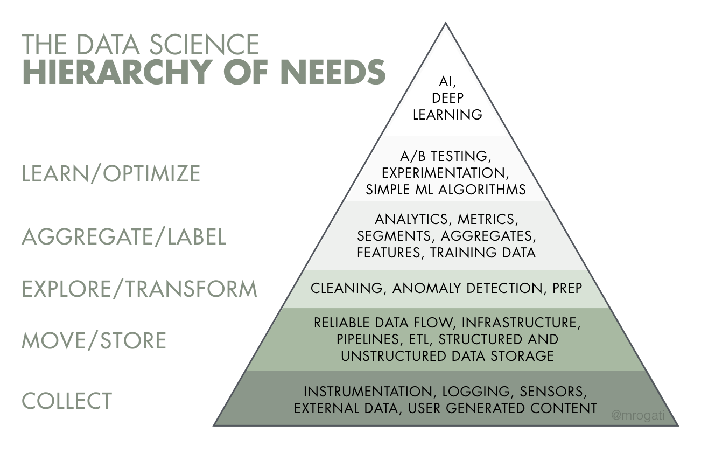
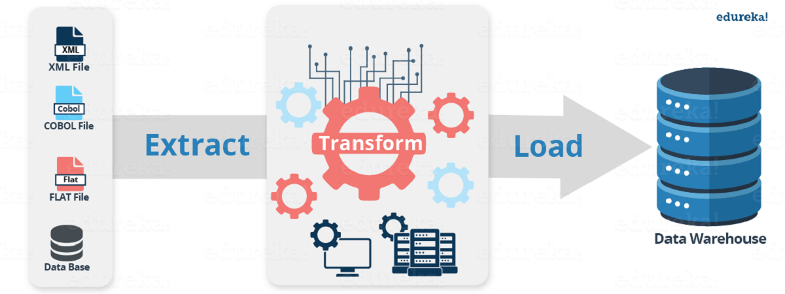

### W2D4 - Data Quality Assurance Process
#### Instructor: Steve Mitchell


#### Overview

- Where Data Comes From
- ELT Process Definition
- What is QA in transforming and analyzing data with SQL? (5 mins)
- QA guidelines & process (45 mins)
- Break (10 mins)
- How to spot errors using the Sakila PG database (40 mins)
- Tasks





## Introduction to QA

- Quality assurance **QA** is any **systematic process** of determining whether a product or service meets specified requirements.

- **QA's Goal:** Prevent product defects before they arise.

- Software Quality Assurance **SQA**:
    - QA teams find patterns to improve development cycles.
    - Finding and fixing coding errors can carry unintended consequences (bugs).
    - Developers have multiple strategies to identify potential errors and fix them without introducing bugs.
    - Most likely a SQA or Data Engineer's job.


## Introduction to ETL

- **ETL** stands for **E**xtract, **T**ransform, **L**oad.
- **ETL** is a process used in data management to ensure the **accuracy**, **consistency**, and **quality** of data before it is used for decision-making, reporting, or analytics.
- It is a **data integration** process: combines data from **multiple sources**, transform it into a **consistent** format, and load it into a **target system**.
- Centralized data enables quicker access to insights allowing **Faster Decision-Making**.
- Provides **scalability**: Works well with large volumes of data across various industries.
- It does not compromise the **raw** data.




### Use Case:

Jane had always loved movies. After years of working in a corporate job, she decided it was time to pursue her dream: opening her own DVD rental shop.

To set the shop, Jane found a small storefront with large windows that offered a view of the bustling street.

As she prepared for the grand opening, she realized that managing a rental shop involved more than just having great movies on display; she needed a system to track inventory, rentals, and customer information.


**Extraction**


1. Jane used an Excel where she meticulously copied by hand the titles of the movies she owned, creating columns for key information such as the film title, director, and release year.

2. She realized she was missing some information and so, she turned to online resources like IMDb, where she searched for each title to find the corresponding genre, cast, and rental price.

3. Her Excel sheet was growing, Jane also noticed that the Excel was not going to be good for storing who rent which movie... or how to reach to her customers.

4. She created a form for **New Customers**. But this information was going to have to be ingested somewhere...


**Transform**

Jane realized that Excel was giving her issues: columns were not strictly numbers or text. So, many times, she thought she could sum things up but that was not the case...

Some rental rates were negative too..


She decided to create a relational database because she knew that SQL would guarantee that the data was in the correct format and she would be able to handle her inventory and customer transactions effectively.

She outlined the following tables:

- **Film Table**: This would contain all the movies available for rent.
Columns: `FilmID`, `Title`, `RentalRate`, and `Availability`.

- **Customer Table:** Customers' information.
Columns: `CustomerID`, `Name`, `Email`

- **Rental Table:** This table would track each rental transaction.
Columns: `RentalID`, `FilmID (FK)`, `CustomerID (FK)`, `RentalDate`, `ReturnDate`, and `PaymentStatus`.


Not only where the tables designed, Jane also defined the **data types** and **relationships** between the tables.

She also ensured that the data was **standardized**, no rates smaller than 0.


**Load**

Once the database was set up, Jane began populating it with data. She exported her Excel sheet to CSV format and imported the data into the `Film` table.

She loaded the information of the forms into the `Customers` table and her `Rentals` table is ready for any new actions!

Jane's database is ready for real-time use and analysis.


## Key Stages:
1. **Extract**: Collect data from sources like databases, flat files, and APIs.
2. **Transform**: Clean, aggregate, and format data to meet business requirements. This can include, but is not limited to:
    - Filtering
    - Cleansing
    - Removing duplicates
    - Validating and authenticating the data
3. **Load**: Store the transformed data into a data warehouse or another target system.


# QA Guidelines

When Jane was creating her Database, she did check several things:

1. **Data Accuracy**: Ensures that data transformations produce correct results.
2. **Consistency**: Maintains uniformity across datasets and results.
3. **Validation**: Jane made sure she gave predefined constraints such as allowable values or acceptable formats and data types.
4. **Completeness**: Jane tried to populate all fields and not leave blank spaces with no reason.
5. **Error Detection**: Identifies issues early in the data pipeline to prevent downstream problems.
6. **Compliance**: Ensures that data meets regulatory and business standards.
7. **Performance Standards**: She made sure the database she created can be run from her computer and it is not too slow.
8. **Security and Privacy**: She has made sure that certain tables, such as the ones containing names and addresses are not accessible by anyone.
9. **Documentation and Schema Management**: Jane documented schema changes, relationships, and data models to ensure clarity and consistency.


## Applying QA Techniques in SQL Data Analysis


### The [Sakila](https://dev.mysql.com/doc/sakila/en/) Database

Now, we are Jane.

<table>
<tr>
<td  style="text-align: left;">
<td>


The Sakila database is a sample database provided by MySQL to learn and practice SQL through a realistic and relatable scenario.

<br>

It simulates a DVD rental store, featuring various tables that represent different aspects of the business, including films, customers, rentals, payments, and staff. 

<br>


Take a look at the [documentation](https://dev.mysql.com/doc/sakila/en/sakila-structure-tables.html)

<br>

[Squarespace. (n.d.). Movie rental photo](https://images.squarespace-cdn.com/content/v1/5bdfef0a697a98c05dd88ac0/1587066095645-PW2PBSKOE4J72MXVEUNN/movie.jpg)
<br>

</td>
</tr>
</table>


[jOOQ. (n.d.). Sakila database. *jOOQ*.](https://www.jooq.org/img/sakila.png)


This might be too complicated. For some existing Databases, we use **SchemaSpy**, which is a Java-based tool that analyzes the metadata of a schema in a database and generates a visual representation of it in a browser-displayable format.

For the **Sakila** database, we can find the **SchemaSpy** [here](https://schemaspy.sourceforge.net/sakila/)

```SQL
SELECT * FROM FILM
LIMIT 2;
```


```SQL
SELECT * FROM ACTOR
LIMIT 5;
```


1. **Validate Data Types:**
To check the data types of the columns in a table, you can query the information schema:


```SQL
-- Validate data types for the 'film' table
SELECT column_name, data_type, is_nullable
FROM information_schema.columns
WHERE table_name = 'film';
```

2. **Data Profiling:** Count the total rows and retrieve sample data from a table.


```SQL
SELECT COUNT(*) AS total_rows FROM customer;
```

```SQL
SELECT *
FROM customer
LIMIT 5;
```

```SQL
SELECT COUNT(*) FROM film;
```

```SQL
SELECT rental_rate, COUNT(*) AS film_count
FROM film
GROUP BY rental_rate;
```

**Flag 1: negative rental rates**

How many unique customers are in the 'customer' table?


```SQL
SELECT COUNT(DISTINCT customer_id) FROM customer;
```

Are there any nulls in the `film_id`?

```SQL
SELECT COUNT(*) FROM inventory WHERE film_id IS NULL;
```

4. **Regular Audits**
 Are there any negative rental rates? (We saw earlier that yes, but this is an alternate way of checking)

```SQL
SELECT *
FROM film
WHERE rental_rate < 0;
```

Interestingly, titles are "Negative", implying they are not real movies.
Seeing last update, we see that these have been added in 2024, whereas most films have been added in 2004.
So, we will ignore data added in 2024.
**explanation of why you did something**


### Manipulating Tables when Finding Errors

1. Fix **Missing** or **Null** Values in Critical Columns

Let's check for missing values in `customer_id`, `first_name`, `last_name` or `email` in the **customer** table.


```SQL
SELECT customer_id, first_name, last_name, email
FROM customer
WHERE first_name IS NULL OR last_name IS NULL OR email IS NULL;
```

That's great! What would happen if I actually tried to enter a new entry in customers where I had a NULL name?


```SQL
-- Add customer with a NULL first name
INSERT INTO customer 
    (store_id, first_name, last_name, email, address_id, active, create_date)
VALUES (1, NULL, 'Smith', 'smith@example.com', 2, 1, NOW());
```

Let's create a new table `customers2`, where NULL values will be allowed:

```SQL
DROP TABLE IF EXISTS customers2;

CREATE TABLE customers2 AS
SELECT * FROM customer;

ALTER TABLE customers2 ALTER COLUMN first_name DROP NOT NULL;
ALTER TABLE customers2 ALTER COLUMN last_name DROP NOT NULL;
ALTER TABLE customers2 ALTER COLUMN email DROP NOT NULL;
```

```SQL
-- Add customer2 with a NULL first name
INSERT INTO customers2 (store_id, first_name, last_name, email, address_id, active, create_date)
VALUES (1, NULL, 'Smith', 'smith@example.com', 2, 1, NOW());
```

```SQL
SELECT customer_id, first_name, last_name, email
FROM customers2
WHERE first_name IS NULL OR last_name IS NULL OR email IS NULL;
```

Assuming NULLs were possible.

Possible fix:  
Do not alter your **raw** data; ideally create a new table.

```SQL
-- Create or replace a fixed version of the 'customer' table with placeholders for missing values
CREATE OR REPLACE TABLE customer_fixed AS
SELECT customer_id,
       COALESCE(first_name, 'Unknown') AS first_name,
       COALESCE(last_name, 'Unknown') AS last_name,
       COALESCE(email, 'no_email@domain.com') AS email
FROM customer;
```

2. Detect **Negative** Rental Rates


```SQL
SELECT * from film
limit 1;
```

```SQL
SELECT film_id, title, rental_rate
FROM film
WHERE rental_rate < 0;
```

Possible fix: Set Negative Rental Rates to 0.99

```SQL
CREATE OR REPLACE TABLE film_fixed AS
SELECT film_id, title,
       CASE
          WHEN rental_rate < 0 THEN 0.99
          ELSE rental_rate
       END AS rental_rate
FROM film;
```

3. Detect **Duplicate** Customers based on name and email.

```SQL
SELECT first_name, last_name, email, COUNT(*)
FROM customers2
GROUP BY first_name, last_name, email
HAVING COUNT(*) > 1;
```

Possible fix: Deduplicate Customers by keeping only the first occurrence

```SQL
CREATE OR REPLACE TABLE customer_deduped AS
WITH ranked_customers AS (
  SELECT *, ROW_NUMBER() OVER (PARTITION BY first_name, last_name, email ORDER BY customer_id) AS rn
  FROM customer
)
SELECT *
FROM ranked_customers
WHERE rn = 1;
```

4. Detect Orphaned Records in Inventory: `film_id` does not exist in `inventory` table.

```SQL
SELECT i.inventory_id, i.film_id
FROM inventory i
LEFT JOIN film f ON i.film_id = f.film_id
WHERE f.film_id IS NULL;
```

```SQL
INSERT INTO inventory (film_id, store_id, last_update)
VALUES
(10001, 1, NOW());
```

I can have movies information - just not have them in the inventory.


```SQL
SELECT i.inventory_id, i.film_id
FROM inventory i
WHERE i.film_id = 1001
```

```SQL
SELECT f.film_id
FROM film f
WHERE f.film_id = 1001
```

Possible fix: Remove Orphaned Records

```SQL
CREATE OR REPLACE TABLE inventory_fixed AS
SELECT *
FROM inventory
WHERE film_id IN (SELECT film_id FROM film);
```

5. Fix **Inconsistent** or Outdated Data:  
Detect Overdue Rentals (Illogical Return Dates): Rentals where `return_date` is earlier than `rental_date`

```SQL
SELECT rental_id, rental_date, return_date
FROM rental
WHERE return_date < rental_date;
```

```SQL
SELECT rental_id, rental_date, return_date
FROM rental_reverse
WHERE return_date < rental_date
LIMIT 2;
```

Possible Fix: Set Invalid Return Dates to a Default Value (e.g., rental_date + 1 day)

```SQL
CREATE OR REPLACE TABLE rental_fixed AS
SELECT rental_id, rental_date,
       CASE
          WHEN return_date < rental_date THEN return_date + INTERVAL '1 day'
          ELSE return_date
       END AS return_date
FROM rental;
```

### Summary

- **Quality Assurance** in SQL is vital for ensuring the **reliability**, **accuracy**, and **integrity** of data stored within relational databases.
- Through our exploration of the **Sakila** database, we have applied various SQL queries that underscore the importance of **QA** practices in data management.

- The queries applied to the **Sakila** database enhance our understanding of data, promote integrity, and facilitate informed decision-making.

## Challenge Time

**Task 1:** Write a query to ensure that the number of active customers listed in the customer table matches the number of customers who have rentals in the rental table.


**Task 2:** Write a query to check whether each store has a minimum number of copies of each film in their inventory (e.g., at least 5 copies per film in each store).


**Task 3:** Write a query to check whether each store has a minimum number of copies of each film in their inventory (e.g., at least 5 copies per film in each store).


**Task 4:** Discuss the importance of using foreign key constraints and referential integrity in maintaining data accuracy between tables in the Sakila database (e.g., linking the rental table to the inventory and customer tables)


### Appendix

**DDL Queries**

- Creating tables:
```SQL
CREATE TABLE table_name(
    column1 datatype,
    column2 datatype,
    column3 datatype,
    ...
    );
```

- Dropping tables:
```SQL
DROP TABLE table_name;
```

- Altering tables (adding a column):
```SQL
ALTER TABLE table_name
ADD column_name datatype;
```

- Alter tables (dropping a column):
```SQL
ALTER TABLE table_name
DROP COLUMN column_name;
```

- Altering tables (modifying a column):
```SQL
ALTER TABLE table_name
MODIFY column_name datatype;
```